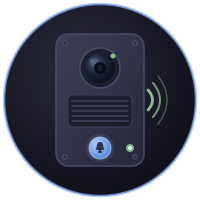

 <div align="center">
  
</div>

# DoorPhoneServer

Sistema di citofonia IP basato su Mumble per Raspberry Pi. Gestisce chiamate audio bidirezionali, controllo relè porta, telecamera IP, notifiche push e automazione domestica tramite MQTT/Tasmota.

---

## Ecosistema DoorPhone

DoorPhoneServer è il cuore del sistema, ma fa parte di un ecosistema più ampio:

| Repository | Descrizione |
|---|---|
| **[DoorPhoneServer](https://github.com/MirkoUgoliniDev/DoorPhoneServer)** ← *sei qui* | Server Go per Raspberry Pi: audio, relè, telecamera, notifiche |
| **[DoorPhoneAndroidApp](https://github.com/MirkoUgoliniDev/DoorPhoneAndroidApp)** | App Android per tablet a parete — display citofono con video, apertura porta e gestione chiamate Mumble |
| **[DoorPhoneServerUSBInterface](https://github.com/MirkoUgoliniDev/DoorPhoneServerUSBInterface)** ⚠ *in sviluppo* | Scheda di espansione USB con ESP32-S3: lettore RFID, pulsanti dei piani, relè apertura porta — alternativa ai GPIO del Pi per un'installazione più pulita ed espandibile |

### DoorPhoneAndroidApp

L'app trasforma un tablet Android montato a parete nell'interfaccia del citofono: mostra il feed della telecamera, gestisce le chiamate Mumble in entrata, permette di aprire la porta con un tocco e visualizza notifiche. Non richiede un account cloud — comunica direttamente con il server Mumble sulla LAN.

### DoorPhoneServerUSBInterface — scheda ESP32-S3 ⚠ Work in progress

Invece di collegare relè, pulsanti e lettore RFID direttamente ai GPIO del Raspberry Pi, questa scheda si interpone come **periferica USB CDC** (`/dev/esp32`, 115200 baud). Il Pi la vede come un dispositivo seriale USB; la scheda gestisce tutta la parte hardware sul campo.

**Vantaggi rispetto ai GPIO diretti:**
- Nessun rischio di danneggiare il Pi con tensioni esterne
- Cablaggio più pulito: un solo cavo USB tra Pi e quadro elettrico
- Espandibile: la scheda ESP32-S3 può gestire molti più ingressi/uscite di quanti ne offrano i GPIO del Pi
- Sostituibile senza toccare il Pi: basta re-flashare l'ESP32

**Cosa gestisce:**
- Lettore NFC/RFID DESFire EV3 (accesso con badge — autenticazione AES-128 a 3 passi, rilevamento tipo automatico)
- Pulsanti di piano P1/P2/P3 con interrupt GPIO e debounce
- Relè apertura porta/cancello (impulso 200ms)
- Alimentazione tablet Android (on/off)
- Ventola PWM 25kHz (raffreddamento quadro elettrico)
- **Display occupanti** — testi configurabili per P1/P2/P3 (4 nominativi per piano), visualizzati su display OLED/LCD, persistiti su LittleFS

**Protocollo Pi → ESP32 (comandi inviati via USB):**

| Comando | Azione |
|---------|--------|
| `UNLOCK-DOOR` | Impulso relè portone 200ms |
| `TABLET-ON` | Alimentazione tablet ON (GPIO17) |
| `TABLET-OFF` | Alimentazione tablet OFF (GPIO17) |
| `FAN-XX` | Ventola PWM al XX% (es. `FAN-75`) |
| `GET-STATE` | Richiesta stato corrente (fan + tablet) |
| `FLOOR-GET` | Richiesta testi occupanti correnti (P1/P2/P3, 4 slot per piano) |
| `FLOOR-SET P1 s1\|s2\|s3\|s4` | Imposta i 4 nominativi del piano 1 (pipe-separated, max 20 char) |
| `PING` | Watchdog keepalive (ogni 5s) |
| `TAG-SCAN` | Aggiunta tag NFC in modalità auto-detect: l'ESP32 rileva il tipo da solo |
| `TAG-DEL <uid>` | Rimuove un tag dalla whitelist NVS |
| `TAG-LIST` | Elenca tutti i tag autorizzati in NVS |
| `TAG-CLEAR` | Cancella tutta la whitelist NVS |

**Protocollo ESP32 → Pi (eventi e risposte via USB):**

| Messaggio | Significato |
|-----------|-------------|
| `EVT p1 0` / `EVT p2 0` / `EVT p3 0` | Pulsante piano premuto (active-low) |
| `RING-P1` / `RING-P2` / `RING-P3` | Chiamata dal piano (LED verde nel pannello per 2s) |
| `EVT nfc <uid>` | Tag NFC letto in modalità normale |
| `UID-OK` | Tessera NFC autenticata → portone aperto |
| `UID-KO` | Tessera NFC rifiutata |
| `TAG-INFO <uid> PLAIN` | Tag rilevato in auto-scan: MIFARE Classic o NTAG |
| `TAG-INFO <uid> DESFIRE-CONFIGURED` | Tag rilevato in auto-scan: DESFire già con la nostra chiave |
| `TAG-INFO <uid> DESFIRE-NEW` | Tag rilevato in auto-scan: DESFire vergine, verrà inizializzato |
| `TAG-ENROLLED <uid> PLAIN\|DESFIRE` | Tag aggiunto alla whitelist con successo |
| `TAG-FORMAT-OK <uid>` | DESFire inizializzato — rimuovere e riavvicinare il tag |
| `TAG-FORMAT-FAIL` / `TAG-FORMAT-FAIL NOT-DESFIRE` | Errore inizializzazione DESFire |
| `TAG-ENROLL-FAIL FULL\|AUTH\|ALREADY` | Errore aggiunta tag (whitelist piena / auth fallita / già presente) |
| `TAG-DEL-OK` / `TAG-DEL-FAIL NOT-FOUND` | Conferma rimozione tag |
| `STATE FAN:75 TABLET:ON` | Risposta a `GET-STATE` — stato corrente ventola e tablet |
| `FLOOR-P1 s1\|s2\|s3\|s4` | Risposta a `FLOOR-GET` — 4 slot del piano 1 (poi P2, P3) |
| `ACK FLOOR-SET P1` | Conferma ricezione `FLOOR-SET` per il piano 1 (entro 3s) |
| `PONG` | Risposta al PING |
| `ACK UNLOCK-DOOR` | Conferma esecuzione apertura portone |
| `ACK TABLET-ON` / `ACK TABLET-OFF` | Conferma cambio stato tablet |
| `ACK FAN-XX` | Conferma impostazione ventola |

**Come funziona l'aggiunta di un tag NFC (flusso auto-detect):**

Il pannello web chiede solo il nome del titolare. L'ESP32 identifica autonomamente il tipo di tag:
- **Tag normale (MIFARE/NTAG)** → aggiunto direttamente alla whitelist in un solo tap
- **DESFire già configurato** → aggiunto direttamente in un solo tap
- **DESFire nuovo** → inizializzato con la nostra chiave AES, poi aggiunto con un secondo tap

**Sincronizzazione stato al boot:**  
All'avvio della connessione USB il Pi invia automaticamente `GET-STATE` e poi `FLOOR-GET`. L'ESP32 risponde con `STATE FAN:XX TABLET:ON/OFF` (da NVS) e con `FLOOR-P1/P2/P3 s1|s2|s3|s4` (da LittleFS), così slider ventola, toggle tablet e testi occupanti nel pannello web riflettono sempre il valore reale dell'hardware anche dopo un riavvio del Pi.

> ⚠ **Repository in sviluppo** — la scheda e il firmware non sono ancora completati. Il protocollo lato server è sviluppato nel branch `GPIO-OVER-USB` di DoorPhoneServer, ma l'integrazione completa è ancora in corso. Non usare in produzione.

---

## Indice

1. [Requisiti hardware](#1-requisiti-hardware)
2. [Parte A — Flash del sistema operativo](#2-parte-a--flash-del-sistema-operativo)
3. [Parte B — Primo avvio e connessione SSH](#3-parte-b--primo-avvio-e-connessione-ssh)
4. [Parte C — Preparazione del sistema](#4-parte-c--preparazione-del-sistema)
5. [Parte D — Setup Wizard: avvio e navigazione](#5-parte-d--setup-wizard-avvio-e-navigazione)
6. [Parte E — Setup Wizard: i passi spiegati](#6-parte-e--setup-wizard-i-passi-spiegati)
7. [Parte F — Dopo l'installazione](#7-parte-f--dopo-linstallazione)
8. [Configurazione doorphoneserver.xml](#8-configurazione-doorphoneserverxml)
9. [Variabili d'ambiente (.env)](#9-variabili-dambiente-env)
10. [Struttura file sul sistema](#10-struttura-file-sul-sistema)
11. [Comandi utili](#11-comandi-utili)
12. [Aggiornamento e rebuild](#12-aggiornamento-e-rebuild)
13. [Problemi comuni](#13-problemi-comuni)
14. [Pannello Web — NFC Whitelist](#14-pannello-web--nfc-whitelist)
15. [Pannello Web — Tab ESP32: Occupanti Piano](#15-pannello-web--tab-esp32-occupanti-piano)

---

## 1. Requisiti hardware

| Componente | Requisito | Note |
|---|---|---|
| Raspberry Pi | **4B 2GB+** (consigliato) | Funziona su 3B+ e 5; il 4B è il più testato |
| microSD | **16 GB minimo**, classe 10 o UHS-1 | 32 GB consigliati per margine |
| Scheda audio USB | **C-Media CM108** o compatibile | Necessaria — il jack del Pi non è sufficiente |
| Alimentatore | **Ufficiale 5V/3A** per Pi 4 | Un alimentatore debole causa crash casuali |
| Connessione di rete | Ethernet (consigliato) o WiFi 2.4/5 GHz | L'Ethernet evita problemi durante l'install |
| PC con terminale | Qualsiasi OS | Per connettersi via SSH durante l'install |

**Hardware opzionale:**
- **Scheda USB Interface (ESP32-S3)** ⚠ *in sviluppo* — lettore NFC DESFire EV3, pulsanti di piano, relè porta, alimentazione tablet, ventola PWM via USB; vedi [DoorPhoneServerUSBInterface](https://github.com/MirkoUgoliniDev/DoorPhoneServerUSBInterface)
- Modulo relè GPIO 5V per controllo elettroserratura (alternativa alla scheda USB)
- Tablet Android con [DoorPhoneAndroidApp](https://github.com/MirkoUgoliniDev/DoorPhoneAndroidApp) — display citofono a parete
- Telecamera IP con stream RTSP (testata: Reolink)
- Dongle WiFi USB se vuoi WiFi ridondante

---

## 2. Parte A — Flash del sistema operativo

### A1. Scarica Raspberry Pi Imager

Vai su **[raspberrypi.com/software](https://www.raspberrypi.com/software/)** e scarica l'Imager per il tuo sistema operativo (Windows, macOS, Linux). Installalo e aprilo.

### A2. Scegli il sistema operativo

Nel menu **"Scegli OS"**, naviga in:
```
Raspberry Pi OS (other)
  → Raspberry Pi OS Lite (64-bit)
```

> Scegli sempre l'**ultima versione disponibile** — l'Imager la evidenzia in automatico come "Recommended". Scegli **Lite** (senza desktop): DoorPhoneServer gira come servizio di sistema e non ha bisogno di interfaccia grafica. Scegli la variante **64-bit**.

### A3. Scegli la microSD

Nel menu **"Scegli Storage"**, seleziona la tua microSD.

> Attenzione: tutto il contenuto della SD verrà cancellato.

### A4. Configura le impostazioni avanzate (FONDAMENTALE)

Prima di scrivere, clicca l'icona **⚙ (Impostazioni avanzate)** in basso a destra. Questa finestra permette di pre-configurare il Pi senza dover collegare monitor e tastiera.

Compila tutti i campi:

| Campo | Valore consigliato |
|---|---|
| **Nome host** | `doorphoneserver` |
| **Abilita SSH** | ✅ Sì — usa autenticazione tramite password |
| **Username** | `pi` |
| **Password** | Una password sicura (annotala!) |
| **Configura WiFi** | Inserisci SSID e password della tua rete (anche se usi Ethernet, configuralo per sicurezza) |
| **Paese WiFi** | IT |
| **Fuso orario** | Europe/Rome |
| **Layout tastiera** | it |

Clicca **Salva**, poi **Scrivi**. Attendi il completamento (3–5 minuti).

### A5. Inserisci la SD e accendi il Pi

Inserisci la microSD nel Pi, collega il cavo Ethernet (se disponibile) e il cavo di alimentazione.

Il Pi impiega **60–90 secondi** per completare il primo avvio e diventare raggiungibile in rete.

---

## 3. Parte B — Primo avvio e connessione SSH

### B1. Trova l'IP del Pi

**Metodo 1 — Nome host (il più semplice):**
Il nome host impostato nell'Imager è accessibile direttamente:
```
doorphoneserver.local
```

**Metodo 2 — Dal router:**
Accedi all'interfaccia del tuo router (solitamente `192.168.1.1`) e cerca nella lista dei dispositivi connessi il nome `doorphoneserver`.

**Metodo 3 — Da terminale sul PC (Linux/macOS):**
```bash
ping doorphoneserver.local
```
L'IP viene mostrato nell'output, es. `PING doorphoneserver.local (192.168.1.151)`.

### B2. Connettiti via SSH

**Su Linux / macOS**, apri il Terminale e digita:
```bash
ssh pi@doorphoneserver.local
```

**Su Windows**, usa Windows Terminal o PowerShell:
```powershell
ssh pi@doorphoneserver.local
```

> Se `.local` non funziona usa l'IP diretto: `ssh pi@192.168.1.XXX`

**Al primo collegamento** vedrai questo messaggio — digita `yes` e premi Invio:
```
The authenticity of host 'doorphoneserver.local' can't be established.
ED25519 key fingerprint is SHA256:...
Are you sure you want to continue connecting (yes/no/[fingerprint])? yes
```

Inserisci la password che hai impostato nell'Imager. Se tutto è corretto, vedrai il prompt:
```
pi@doorphoneserver:~ $
```

Sei dentro. Da qui in poi tutti i comandi vanno digitati in questo terminale SSH.

---

## 4. Parte C — Preparazione del sistema

### C1. Aggiornamento del sistema operativo

Il primo passo è aggiornare tutti i pacchetti all'ultima versione. Questo è importante per avere le dipendenze corrette e le patch di sicurezza:

```bash
sudo apt-get update && sudo apt-get -y full-upgrade
```

- `apt-get update` scarica la lista aggiornata dei pacchetti (~30 secondi)
- `full-upgrade` installa tutti gli aggiornamenti (~2–5 minuti su connessione normale)

Output atteso alla fine:
```
0 upgraded, 0 newly installed, 0 to remove and 0 not upgraded.
```
oppure una lista di pacchetti aggiornati.

**Riavvia** per applicare eventuali aggiornamenti al kernel:
```bash
sudo reboot
```

Attendi 30–60 secondi e riconnettiti via SSH:
```bash
ssh pi@doorphoneserver.local
```

### C2. Installa git, pip e Flask

Questi pacchetti sono necessari per clonare il repository e avviare il wizard:

```bash
sudo apt install git -y
sudo apt install python3-pip -y
sudo apt install python3-flask -y
```

### C3. Collega la scheda audio USB

**Prima di procedere**, collega la scheda audio USB al Pi.

Verifica che il sistema operativo la riconosca:
```bash
aplay -l
```

Output atteso (esempio):
```
card 0: vc4hdmi0 [vc4-hdmi-0], device 0: MAI PCM i2s-hifi-0 []
card 1: Device [USB Audio Device], device 0: USB Audio [USB Audio]
```

Deve comparire una voce con "USB Audio" o il nome della tua scheda. Se non compare:
- Prova una porta USB diversa
- Verifica che la scheda sia alimentata (alcune richiedono USB 3.0)
- Riavvia il Pi con la scheda già collegata

### C4. Clona il repository

Clona il repository di DoorPhoneServer nella cartella home dell'utente `pi`:

```bash
git clone https://github.com/MirkoUgoliniDev/DoorPhoneServer ~/doorphoneserver-setup
```

Questo crea la cartella `~/doorphoneserver-setup/` con tutto il codice sorgente e il wizard di installazione. Richiede ~10–30 secondi a seconda della connessione.

Spostati nella cartella clonata:
```bash
cd ~/doorphoneserver-setup
```

Verifica che i file siano presenti:
```bash
ls
```

Dovresti vedere: `cmd/`, `setup/`, `go.mod`, `doorphoneserver.xml`, `preferences/`, ecc.

---

## 5. Parte D — Setup Wizard: avvio e navigazione

### D1. Avvia il wizard in modalità Web

```bash
python3 setup/wizard.py --web
```

Il wizard stampa l'indirizzo da aprire nel browser, ad esempio:
```
 DoorPhoneServer Setup Wizard v2.0.0
 → Web UI in ascolto su http://192.168.1.151:8888
 Premi Ctrl+C per uscire
```

**Apri quell'indirizzo nel browser** del tuo PC, tablet o telefono connesso alla stessa rete WiFi/LAN.

> Il terminale SSH deve restare aperto mentre usi il wizard nel browser.
> Se chiudi il terminale SSH, il wizard si ferma.

### D2. Interfaccia del wizard — panoramica

L'interfaccia ha tre aree:

**Barra laterale sinistra** — lista di tutti i passi con stato (cerchio vuoto = in attesa, spunta = completato, X = fallito).

**Area centrale in alto** — toggle DRY-RUN, pulsanti Avvia/Interrompi, barra di progresso.

**Area centrale — card dei passi** — ogni passo mostra il suo form di configurazione e, durante l'esecuzione, il log in tempo reale.

### D3. Modalità DRY-RUN

In alto a sinistra c'è un toggle **DRY-RUN attivo** (acceso di default).

In modalità DRY-RUN il wizard simula tutta l'installazione senza modificare nulla sul sistema. Utile per capire cosa farà.

**Per installare davvero**, spegni il DRY-RUN cliccando il toggle — il badge cambia da "SIMULAZIONE" a "INSTALLAZIONE REALE".

---

## 6. Parte E — Setup Wizard: i passi spiegati

Prima di cliccare **Avvia Installazione**, compila i campi nei passi configurabili. Scorri le card dall'alto in basso.

### Credenziali .env (compilare PRIMA di avviare)

Questo passo scrive il file `/home/doorphoneserver/.env` con le credenziali sensibili.

| Campo | Cosa inserire |
|---|---|
| **Mumble Username** | Il nome che apparirà sul server Mumble. Default: `Doorpi`. Lascialo così. |
| **Mumble Password** | Scegli una password per il server Mumble locale. Annotala — servirà anche nel client. |
| **Camera Username** | Username della telecamera IP (es. `admin`). Lascia vuoto se non hai la telecamera. |
| **Camera Password** | Password della telecamera IP. |
| **Pushover API Token** | Token dell'app Pushover per notifiche push. Lascia vuoto se non lo usi. |
| **Pushover User Key** | Chiave utente Pushover. |
| **OpenRouter API Key** | API key per funzionalità AI. Lascia vuoto se non lo usi. |

### Hostname (opzionale)

Il nome del Pi in rete. Default: `doorphoneserver`. Cambialo solo se hai un motivo specifico.

### Configurazione Audio

Il wizard rileva automaticamente le schede audio presenti al momento dell'avvio.

- **AUDIO OUTPUT** — seleziona la scheda USB (non "bcm2835" che è l'audio integrato del Pi, inutilizzabile per citofonia)
- **AUDIO INPUT** — seleziona la stessa scheda USB

Se i dropdown mostrano "(nessuna scheda rilevata)":
1. Assicurati che la scheda USB sia collegata
2. Clicca **Aggiorna schede**
3. Se ancora non compare, apri un secondo terminale SSH e digita `aplay -l` per diagnosticare

### Log2Ram (opzionale ma consigliato)

Log2Ram mantiene i file di log in RAM e li sincronizza su disco periodicamente, riducendo drasticamente le scritture sulla microSD. Estende significativamente la vita della SD.

- **Dimensione RAM per log** — default 128M, sufficiente per uso normale
- Lascia le altre opzioni ai valori predefiniti

---

### Avvia l'installazione

Quando hai compilato tutti i campi:

1. **Disattiva il DRY-RUN** (toggle in cima)
2. Clicca **▶ Avvia Installazione**
3. Il pulsante Avvia si disabilita e si abilita "Interrompi"

Il wizard esegue i passi in sequenza. Per ciascuno vedi il log in tempo reale nella card corrispondente.

**Tempo totale atteso:** 20–40 minuti. Il passo più lungo è **Clone & Build** (compilazione Go).

---

### Cosa fa ogni passo — dettaglio

#### Passo 1 — Controllo Sistema
Verifica: modello Pi, architettura, versione OS, spazio disco (servono almeno 3 GB liberi), presenza di sudo, connessione internet.
Se questo passo fallisce, controlla spazio su disco (`df -h`) e connessione internet.

#### Passo 2 — Hostname
Imposta il nome host con `hostnamectl` e aggiorna `/etc/hosts`.
Nessuna interazione richiesta.

#### Passo 3 — Utente di Sistema
Crea l'utente di sistema `doorphoneserver` (senza login, usato solo dal servizio) e lo aggiunge ai gruppi `audio`, `gpio`, `dialout`.
Se l'utente esiste già (reinstallazione), aggiorna solo i gruppi.

#### Passo 4 — Credenziali .env
Scrive `/home/doorphoneserver/.env` con le credenziali inserite nel form, con permessi `600` (leggibile solo dall'utente di sistema).

#### Passo 5 — Pacchetti APT
Esegue `apt-get update` e installa ~15 pacchetti: librerie audio (libopenal, libopus, libasound2, alsa-utils), strumenti di build, ffmpeg, mplayer, mumble-server, python3-flask, rsync, lz4.
Questo passo richiede **3–8 minuti** a seconda della velocità di internet.

#### Passo 6 — Go Language
Scarica e installa Go 1.24.4 da golang.org (~130 MB) in `/usr/local/go/`.
Se Go è già installato alla versione corretta, il passo lo rileva e salta il download.
Richiede **2–5 minuti** di download.

#### Passo 7 — Configurazione Audio
Rileva le schede audio presenti e scrive `/etc/asound.conf` con la configurazione ALSA corretta (dmix + dsnoop per condivisione del device).
Aggiorna anche il parametro `outputdevice` in `doorphoneserver.xml` con il nome del controllo mixer rilevato.

#### Passo 8 — Mumble Server
Configura `/etc/mumble-server.ini` con la password scelta e avvia il servizio `mumble-server`.
Verifica che il servizio sia attivo dopo l'avvio (attende fino a 15 secondi).

#### Passo 9 — Config Boot RPi
Esegue `setup/scripts/setup_configs.sh` che modifica `/boot/firmware/config.txt`:
- Disabilita audio BCM integrato (`dtparam=audio=off`)
- Disabilita Bluetooth (`dtoverlay=disable-bt`)
- Imposta GPU memory a 16 MB (headless)
- Disabilita rilevamento display automatico
Scrive anche `/etc/openal/alsoft.conf` e le blacklist modprobe per WiFi USB concorrenti.

#### Passo 10 — Clone & Build
Clona il repository da GitHub in `/home/doorphoneserver/gocode/src/github.com/doorphoneserver/doorphoneserver/` e compila il binario `doorphoneserver`.
**Questo è il passo più lungo: 10–25 minuti su Pi 4.**
Il log mostra i pacchetti Go compilati in tempo reale. È normale che sia silenzioso per lunghi periodi.

#### Passo 11 — Directory & Certificati
Crea la cartella `preferences/`, genera il certificato TLS per Mumble (`openssl`) e copia `doorphoneserver.xml` nella home dell'utente di sistema con il path del certificato aggiornato.

#### Passo 12 — Servizio Systemd
Installa `/etc/systemd/system/doorphoneserver.service`, lo abilita all'avvio automatico e configura il file sudoers per permettere al servizio di controllare systemctl senza password.
Installa anche il crontab per i riavvii notturni programmati.

#### Passo 13 — Log2Ram (opzionale)
Aggiunge il repository APT di azlux.fr, installa log2ram, configura `/etc/log2ram.conf` con le dimensioni scelte e ottimizza `journald.conf` per storage volatile.

#### Passo 14 — Pulizia
Rimuove la cache Go dall'utente pi (`~/go/pkg/`) e pulisce la cache APT. Mostra un messaggio con il comando da eseguire per rimuovere la cartella di setup dopo aver chiuso il wizard.

---

### Se un passo fallisce

I passi non critici (Log2Ram) vengono saltati senza bloccare l'installazione.
I passi critici mostrano `✗` e il nome del passo appare nella lista "Passi falliti" al termine.

Se un passo critico fallisce:
1. Leggi il log del passo per capire il motivo
2. Risolvi il problema (es. connessione internet, spazio su disco)
3. Clicca di nuovo **▶ Avvia Installazione** — il wizard ri-esegue dall'inizio (è idempotente: rieseguire passi già completati è sicuro)

---

## 7. Parte F — Dopo l'installazione

### F1. Configura doorphoneserver.xml

Al termine del wizard, **prima di riavviare**, aggiorna la configurazione principale:

```bash
nano /home/doorphoneserver/doorphoneserver.xml
```

Parametri da personalizzare:

**IP telecamera** — cerca e sostituisci `192.168.1.124` con l'IP reale della tua telecamera:
```xml
<endpoint>rtsp://192.168.1.XXX:554/Preview_01_sub</endpoint>
<endpoint>http://192.168.1.XXX/cgi-bin/api.cgi?cmd=Snap...</endpoint>
```

**Dispositivi Tasmota** — se hai prese/relè Tasmota, abilita e configura:
```xml
<device name="device1" type="tasmota" url="http://192.168.1.XXX" enabled="true" desc="Elettroserratura"/>
```

Per salvare in nano: `Ctrl+O` → Invio → `Ctrl+X`

> Il wizard ha già aggiornato automaticamente: `outputdevice`, `certificate`, `serverandport`.
> Non toccare questi campi.

### F2. Verifica i gruppi utente

Verifica che l'utente di sistema sia nei gruppi corretti:

```bash
id doorphoneserver
```

L'output deve includere `audio`, `dialout`, `gpio`:
```
uid=1001(doorphoneserver) gid=1001(doorphoneserver) groups=1001(doorphoneserver),29(audio),20(dialout),986(gpio)
```

Se `audio` o `dialout` mancano, aggiungili manualmente:
```bash
sudo usermod -aG audio,dialout doorphoneserver
```

### F3. Riavvio finale

```bash
sudo reboot
```

Il Pi si riavvia (~45 secondi). Dopo il riavvio:
- `mumble-server` parte automaticamente
- `doorphoneserver` parte automaticamente (dopo 15 secondi di attesa per la rete)
- Se installato, `log2ram` monta il filesystem in RAM

### F4. Verifica che tutto funzioni

Riconnettiti via SSH e controlla i servizi:

```bash
# Servizio principale
systemctl status doorphoneserver
```

Deve mostrare `Active: active (running)`. Se mostra `failed` o `inactive`:
```bash
journalctl -u doorphoneserver -n 50
```

```bash
# Mumble server
systemctl status mumble-server
# Deve mostrare: active (running), porta 64738
```

```bash
# Schede audio (verifica che la USB sia presente)
aplay -l
# Deve mostrare la scheda USB oltre a eventuali schede HDMI
```

### F5. Connetti il client Mumble

Dal client Mumble (smartphone, PC, tablet), connettiti al server con:

| Campo | Valore |
|---|---|
| Indirizzo | IP del Raspberry Pi (es. `192.168.1.151`) |
| Porta | `64738` |
| Username | Quello scelto (es. `Doorpi`) |
| Password | La password Mumble inserita nel wizard |

Se la connessione riesce, l'installazione è completata con successo.

### F6. Pulizia della cartella di setup

Una volta verificato che tutto funziona, puoi rimuovere la cartella del wizard:

```bash
rm -rf ~/doorphoneserver-setup
```

> Conserva il `README.md` a portata di mano (es. apri questa pagina su GitHub) per riferimenti futuri.

---

## 8. Configurazione doorphoneserver.xml

Il file principale è `/home/doorphoneserver/doorphoneserver.xml`. Sezioni chiave:

### Account Mumble

```xml
<accounts>
  <account name="doorphoneserver-community" default="true">
    <serverandport>127.0.0.1:64738</serverandport>
    <insecure>true</insecure>
    <ident>DoorPi</ident>
    <certificate>/home/doorphoneserver/mumble.pem</certificate>
    <channel/>
  </account>
</accounts>
```

### Audio

```xml
<outputdevice>Headphone</outputdevice>
<outputvolcontroldevice>Headphone</outputvolcontroldevice>
<outputmutecontroldevice>Headphone</outputmutecontroldevice>
```

Il nome (`Headphone`, `Speaker`, `PCM`…) dipende dalla scheda USB. Per trovarlo:
```bash
amixer -c 1 scontents | grep "Simple mixer"
```

### Telecamera IP

```xml
<camera debug="false">
  <video enabled="true">
    <endpoint>rtsp://192.168.1.XXX:554/Preview_01_sub</endpoint>
  </video>
  <snapshot enabled="true">
    <endpoint>http://192.168.1.XXX/cgi-bin/api.cgi?cmd=Snap&amp;channel=0&amp;rs=abc</endpoint>
    <dir>/home/doorphoneserver/snapshots</dir>
  </snapshot>
</camera>
```

### HTTP API

```xml
<http listenport="8080" enabled="true">
```

API REST sulla porta 8080. Comandi disponibili: `powertablet_on/off`, `relay`, `takesnapshot`, `listapi`.

### Dispositivi Tasmota

```xml
<device name="device1" type="tasmota" url="http://192.168.1.XXX" enabled="true" desc="Elettroserratura"/>
```

---

## 9. Variabili d'ambiente (.env)

`/home/doorphoneserver/.env` — scritto dal wizard, permessi 600. Non versionato.

```bash
MUMBLE_USERNAME=Doorpi
MUMBLE_PASSWORD=la-tua-password

CAMERA_USERNAME=admin
CAMERA_PASSWORD=password-camera

PUSHOVER_API_TOKEN=
PUSHOVER_USER_KEY=

OPENROUTER_API_KEY=
```

Per modificarlo dopo l'installazione:
```bash
sudo nano /home/doorphoneserver/.env
sudo systemctl restart doorphoneserver
```

---

## 10. Struttura file sul sistema

```
/home/doorphoneserver/              ← home utente di sistema E repo Git
├── *.go                            ← sorgenti Go (repo clonata qui)
├── cmd/doorphoneserver/main.go     ← entrypoint binario
├── setup/                          ← wizard di installazione
├── go.mod / go.sum                 ← moduli Go
├── bin/
│   └── doorphoneserver             ← binario compilato
├── doorphoneserver.xml             ← configurazione principale
├── .env                            ← credenziali (600, non versionato)
├── mumble.pem                      ← certificato TLS Mumble
├── cert.pem / nopasskey.pem        ← componenti certificato
├── preferences/
│   ├── alarms.json
│   ├── ai.json
│   ├── nfc_whitelist.json          ← whitelist NFC (Pi-side cache)
│   └── floors.json                 ← occupanti piano P1/P2/P3 (4 slot/piano)
├── snapshots/                      ← foto dalla telecamera
└── gocode/                         ← GOPATH (cache build, NON i sorgenti)
    └── pkg/                        ← pacchetti Go pre-compilati (cache)

/etc/
├── asound.conf                     ← ALSA (generato dal wizard)
├── openal/alsoft.conf              ← OpenAL
├── mumble-server.ini               ← Mumble server
├── systemd/system/doorphoneserver.service
├── sudoers.d/doorphoneserver-panel ← systemctl senza password
└── log2ram.conf                    ← se Log2Ram installato

/boot/firmware/config.txt           ← BCM audio off, BT off, headless
```

---

## 11. Comandi utili

### Gestione servizio

```bash
sudo systemctl start doorphoneserver
sudo systemctl stop doorphoneserver
sudo systemctl restart doorphoneserver
systemctl status doorphoneserver
journalctl -u doorphoneserver -f        # log live
journalctl -u doorphoneserver -n 100    # ultimi 100 log
```

### Audio

```bash
aplay -l                                # lista schede output
arecord -l                              # lista schede input
amixer -c 1 scontents                   # controlli mixer scheda 1
speaker-test -c 1 -t wav -D plughw:1   # test speaker
```

### Setup wizard (riconfigura)

```bash
cd ~/doorphoneserver-setup
python3 setup/wizard.py --web           # Web UI
python3 setup/wizard.py --audio-setup  # solo audio
python3 setup/wizard.py --dry-run --web # simulazione
```

### Mumble server

```bash
systemctl status mumble-server
sudo systemctl restart mumble-server
cat /etc/mumble-server.ini
ss -tlnp | grep 64738                   # verifica porta in ascolto
```

### Log2Ram

```bash
systemctl status log2ram
sudo log2ram sync                       # forza sync RAM → disco
```

---

## 12. Aggiornamento e rebuild

Per aggiornare il software dopo l'installazione iniziale:

```bash
# Aggiorna i sorgenti (il repo è nella home dell'utente di sistema)
sudo -u doorphoneserver git -C /home/doorphoneserver pull

# Ricompila e installa il binario
sudo bash /home/doorphoneserver/setup/scripts/build.sh

# Riavvia il servizio
sudo systemctl start doorphoneserver
```

Il build script ferma il servizio, compila (~5–15 minuti su Pi 4), installa il nuovo binario e mostra la dimensione del file.

> Il codice sorgente Go vive direttamente in `/home/doorphoneserver/` (la home è la repo).
> La cartella `gocode/` è solo la cache di build GOPATH — non contiene i sorgenti.

---

## 13. Problemi comuni

### `ModuleNotFoundError: No module named 'flask'`
```bash
sudo apt-get install -y python3-flask
```

### Nessuna scheda audio nel wizard
1. Verifica: `aplay -l` — la scheda USB deve comparire
2. Prova una porta USB diversa
3. Riavvia il Pi con la scheda già collegata

### Il servizio non trasmette audio
```bash
id doorphoneserver   # verifica che "audio" e "dialout" siano presenti
sudo usermod -aG audio,dialout doorphoneserver
sudo systemctl restart doorphoneserver
```

### Il servizio si avvia ma crasha subito
```bash
journalctl -u doorphoneserver -n 50
```
Cause frequenti: XML malformato, path certificato errato, Mumble server non raggiungibile.

### Mumble server non risponde
```bash
sudo systemctl restart mumble-server
ss -tlnp | grep 64738   # deve mostrare il processo in ascolto
```

### Il build fallisce
```bash
/usr/local/go/bin/go version   # deve essere >= 1.24.x
# Se Go non è presente o è vecchio, ri-esegui il wizard
```

### Reinstallazione mantenendo le credenziali
```bash
cp /home/doorphoneserver/.env ~/backup.env
cp /home/doorphoneserver/doorphoneserver.xml ~/backup.xml

cd ~/doorphoneserver-setup && git pull
python3 setup/wizard.py --web

# Dopo l'installazione, ripristina se necessario:
sudo cp ~/backup.env /home/doorphoneserver/.env
sudo chown doorphoneserver:doorphoneserver /home/doorphoneserver/.env
sudo chmod 600 /home/doorphoneserver/.env
```

---

## 14. Pannello Web — NFC Whitelist

La pagina **NFC Whitelist** del pannello web (tab "NFC Whitelist") permette di gestire i badge autorizzati ad aprire la porta. Richiede la scheda ESP32-S3 collegata via USB.

---

### Struttura della pagina

La pagina è divisa in due aree:

**Tabella tag autorizzati** — elenco di tutti i badge registrati, con colonne:

| Colonna | Contenuto |
|---|---|
| **UID** | Identificativo unico del tag (14 cifre hex, es. `1C7D223E000000`) |
| **Nominativo** | Nome del titolare assegnato in fase di registrazione |
| **Tipo** | `PLAIN` (MIFARE Classic, NTAG) oppure `DESFIRE` (DESFire EV1/EV2/EV3) |
| **Aggiunto il** | Data e ora di registrazione |
| **Ultimo accesso** | Data e ora dell'ultimo passaggio autorizzato (`—` se mai usato) |
| **Accessi** | Contatore totale degli accessi autorizzati |
| **Azioni** | Pulsanti Modifica e Rimuovi |

**Log USB seriale** — finestra in tempo reale con tutti i messaggi scambiati tra Raspberry Pi e ESP32. Utile per diagnostica. Supporta auto-refresh e pulsante Clear.

---

### Aggiungere un tag

Clicca **Aggiungi Tag**. Si apre un modale che guida l'utente attraverso il processo. Il modale ha **6 stati possibili** descritti di seguito.

---

#### Stato 1 — Inserimento nome (`nfcStepMode`)

Il modale mostra un campo di testo per inserire il nominativo del titolare (massimo 64 caratteri, es. "Mario Rossi"). Il tipo di tag **non va selezionato** dall'utente: l'ESP32 lo rileva autonomamente.

Clicca **Avvia procedura** per procedere. Il pulsante è disabilitato se il campo nome è vuoto.

Cosa succede internamente:
- Il Pi invia `POST /api/whitelist/enroll` con `{ "name": "...", "mode": "auto" }`
- Il server Go invia all'ESP32 il comando `TAG-SCAN\n` via USB seriale
- L'ESP32 risponde `ACK TAG-SCAN PENDING\n` confermando che è in ascolto
- Il Pi apre uno stream SSE (`/api/whitelist/enroll/events`) per ricevere gli aggiornamenti in tempo reale

---

#### Stato 2 — Attesa tag (`nfcStepListen`)

Il modale mostra un conto alla rovescia circolare di **30 secondi** con il messaggio "Avvicina il tag al lettore…".

L'utente avvicina il badge al lettore NFC collegato all'ESP32.

Il timeout è gestito lato server: se entro 35 secondi nessun tag viene letto, il server invia un evento SSE `{ "event": "error", "code": "timeout" }` e il modale passa allo **Stato 5 (timeout)**.

---

#### Stato 3 — Tag rilevato (`nfcStepDetected`)

Appena l'ESP32 legge il tag e ne identifica il tipo, invia via USB la riga `TAG-INFO <uid> <tipo>`. Il server Pi la riceve e la traduce nell'evento SSE `{ "event": "tag-detected", "uid": "...", "tag_type": "..." }`.

Il modale sostituisce il conto alla rovescia con un riquadro informativo che mostra:

| Campo | Contenuto |
|---|---|
| **Icona** | Scudo (DESFire) o antenna Wi-Fi (tag normale) |
| **Tipo identificato** | "Tag Normale (MIFARE / NTAG)", "DESFire (già configurato)", oppure "DESFire (nuovo)" |
| **Nota** | Breve descrizione di cosa avverrà automaticamente |
| **UID** | L'identificativo del tag in formato esadecimale maiuscolo a 14 caratteri |

Da questo punto il flusso si divide in tre percorsi a seconda del tipo rilevato.

---

#### Percorso A — Tag Normale o DESFire già configurato (1 solo tap)

Questi due tipi vengono registrati direttamente senza ulteriori interazioni.

**Flusso messaggi completo:**
```
Pi     → ESP32   TAG-SCAN
ESP32  → Pi      ACK TAG-SCAN PENDING
                 [utente avvicina il tag]
ESP32  → Pi      TAG-INFO <uid> PLAIN          (o DESFIRE-CONFIGURED)
ESP32  → Pi      TAG-ENROLLED <uid> PLAIN      (o DESFIRE)
```

Quando arriva l'evento SSE `enrolled`:
- Il titolo del modale cambia in **"Tag registrato!"**
- Dopo 1,4 secondi il modale si chiude automaticamente
- Appare un toast verde con il nome del titolare appena registrato
- La tabella si aggiorna

---

#### Percorso B — DESFire nuovo (2 tap, con inizializzazione)

Un tag DESFire vergine deve essere prima inizializzato con la chiave AES del sistema prima di poter essere usato per l'autenticazione.

**Flusso messaggi completo:**
```
Pi     → ESP32   TAG-SCAN
ESP32  → Pi      ACK TAG-SCAN PENDING
                 [utente avvicina il tag — PRIMO TAP]
ESP32  → Pi      TAG-INFO <uid> DESFIRE-NEW
                 [ESP32 esegue l'inizializzazione AES internamente]
ESP32  → Pi      TAG-FORMAT-OK <uid>
Pi     → ESP32   TAG-ENROLL                    ← inviato automaticamente dal server Go
                 [utente toglie il tag dal lettore]
```

Quando arriva l'evento SSE `format-ok`, il modale passa allo **Stato 4** (formato OK).

```
                 [utente riavvicina il tag — SECONDO TAP]
ESP32  → Pi      TAG-ENROLLED <uid> DESFIRE
```

Quando arriva l'evento SSE `enrolled`, il modale si chiude come nel Percorso A.

> Il comando `TAG-ENROLL` dopo `TAG-FORMAT-OK` è inviato automaticamente dal server Go (funzione `parseTagFormatOK` in `usb_bridge.go`) — l'utente non deve fare nulla tranne togliere e riavvicinare il badge.

---

#### Stato 4 — DESFire inizializzato, attesa secondo tap (`nfcStepFormatOK`)

Visibile solo nel Percorso B. Il modale mostra:
- Un riquadro con la scritta **"Tag inizializzato"** e l'UID del tag
- Il messaggio "Inizializzazione OK. Rimuovi e riavvicina il tag."
- Un nuovo conto alla rovescia di 30 secondi

L'utente toglie il tag dal lettore e lo riavvicina per completare la registrazione.

---

#### Stato 5 — Errore (`nfcStepError`)

Il modale mostra un'icona di errore triangolare e un messaggio descrittivo. Possibili cause:

| Codice errore | Messaggio mostrato | Causa |
|---|---|---|
| `timeout` | — (vedi Stato 6) | Nessun tag letto entro 35 secondi |
| `already-enrolled` | "Tag già registrato nella NVS" | Il tag è già presente nella whitelist ESP32 |
| `whitelist-full` | "Whitelist piena (max 10 tag)" | La NVS dell'ESP32 ha raggiunto il limite di 10 tag |
| `auth-fail` | "Autenticazione fallita — chiave errata" | Il DESFire ha una chiave AES diversa dalla nostra |
| `format-fail` | "Inizializzazione tag fallita" | Errore generico durante il formato DESFire |
| `not-desfire` | "Il tag non è DESFire" | Il firmware ha ricevuto un tag non DESFire in modalità format |
| `enroll-fail` | "Enrollment fallito" | Errore generico durante la registrazione |
| `cancelled` | "Enrollment annullato" | L'utente ha cliccato Annulla |

In questo stato il pulsante **Riprova** è visibile. Cliccarlo annulla l'operazione corrente sul server (`DELETE /api/whitelist/enroll/cancel`) e riporta il modale allo Stato 1 con il campo nome vuoto.

---

#### Stato 6 — Timeout (`nfcStepTimeout`)

Il modale mostra un'icona di orologio con il messaggio "Timeout: nessun tag rilevato." Il pulsante **Riprova** è visibile con lo stesso comportamento dello Stato 5.

---

#### Annullare l'operazione in qualsiasi momento

Il pulsante **Annulla** è sempre visibile durante il processo. Cliccarlo:
1. Chiude lo stream SSE
2. Invia `DELETE /api/whitelist/enroll/cancel` al server
3. Il server annulla la sessione di enrollment e riporta l'ESP32 in modalità normale
4. Chiude il modale

---

#### Riepilogo flussi per tipo di tag

| Tipo tag | Tap richiesti | Step UI attraversati |
|---|---|---|
| Tag Normale (MIFARE/NTAG) | 1 | Nome → Attesa → Rilevato → Chiusura automatica |
| DESFire già configurato | 1 | Nome → Attesa → Rilevato → Chiusura automatica |
| DESFire nuovo / vergine | 2 | Nome → Attesa → Rilevato → Formato OK → Attesa 2° tap → Chiusura automatica |
| Qualsiasi tipo (errore) | — | Nome → Attesa → Errore → (Riprova o Annulla) |
| Qualsiasi tipo (timeout) | — | Nome → Attesa → Timeout → (Riprova o Annulla) |

---

### Modificare un tag

Clicca **Modifica** sulla riga del tag. Si apre un modale con il campo nome pre-compilato. Modifica il nominativo e clicca **Salva**. Solo il nome è modificabile — l'UID e il tipo sono immutabili.

---

### Rimuovere un tag

Clicca **Rimuovi** sulla riga del tag. Un modale di conferma mostra UID e nome del tag. Clicca **Rimuovi** per confermare.

La rimozione avviene in parallelo sia sulla whitelist JSON del Pi che sulla NVS dell'ESP32 (tramite comando `TAG-DEL`).

---

### Sincronizzare con ESP32 — pulsante Sync ESP32

La whitelist è mantenuta in due posti: il file JSON sul Pi (`preferences/nfc_whitelist.json`) e la NVS flash dell'ESP32. Normalmente sono sempre allineati perché ogni aggiunta e rimozione viene propagata in tempo reale. Il pulsante **Sync ESP32** permette di verificare manualmente l'allineamento.

Cliccando **Sync ESP32** si apre un modale con:

#### Caso: in sync
- Contatori ESP32 e JSON mostrati affiancati, collegati da **↔** verde
- Messaggio: *"I tag su ESP32 e nel JSON corrispondono esattamente."*

#### Caso: differenze rilevate
- Contatori affiancati, collegati da **≠** arancione
- Messaggio che indica quanti tag sono fuori allineamento
- Sezione **"Solo su ESP32 (non nel JSON)"** — lista degli UID presenti sulla NVS dell'ESP32 ma mancanti dal JSON locale
- Sezione **"Solo nel JSON (non su ESP32)"** — lista degli UID presenti nel JSON ma non caricati sulla NVS dell'ESP32

> **Quando può capitare una differenza:**
> - Il Pi è stato reinstallato perdendo il file JSON, ma l'ESP32 conserva ancora i tag in NVS
> - L'ESP32 è stato re-flashato, azzerando la NVS, ma il JSON era già aggiornato
> - Un'operazione è fallita a metà (es. cavo USB staccato durante un'aggiunta)

Per riallineare manualmente: usa **Rimuovi tutti** per azzerare entrambi e poi ri-registra i tag, oppure usa il pulsante **TAG-CLEAR** da terminale se vuoi azzerare solo l'ESP32.

---

### Rimuovere tutti i tag — pulsante Rimuovi tutti

Cancella in un colpo solo tutti i tag sia dal JSON che dalla NVS dell'ESP32 (comando `TAG-CLEAR`). Chiede conferma prima di procedere. Utile durante il provisioning iniziale o per un reset completo.

---

### Persistenza dei dati

| Dove | File / Storage | Note |
|---|---|---|
| Raspberry Pi | `preferences/nfc_whitelist.json` | File JSON, aggiornato ad ogni operazione |
| ESP32-S3 | NVS flash (namespace `nfc_wl`) | Sopravvive ai riavvii, max 10 tag |
| Sincronizzazione | Automatica ad ogni aggiunta/rimozione | Manuale con il pulsante Sync |

---

---

## 15. Pannello Web — Tab ESP32: Occupanti Piano

Il tab **ESP32** del pannello web include una sezione **Occupanti Piano** che permette di impostare i nominativi visualizzati sul display fisico collegato all'ESP32.

### Struttura

- **3 colonne** — una per piano (P1, P2, P3)
- **4 campi di testo** per piano — massimo 20 caratteri ciascuno
- **Pulsante Invia** per piano — trasmette i 4 slot all'ESP32 in un unico comando

### Comportamento

| Evento | Cosa succede |
|--------|-------------|
| Apertura tab ESP32 | Il pannello interroga automaticamente `/api/esp32/status` che include i valori correnti dei 3 piani |
| Connessione USB | Il Pi invia `FLOOR-GET`; l'ESP32 risponde con i valori salvati su LittleFS |
| Click "Invia" (piano P1) | POST `/api/esp32/floors` con `floor=P1&t1=...&t2=...&t3=...&t4=...` → Pi invia `FLOOR-SET P1 s1|s2|s3|s4` → ESP32 salva su LittleFS e risponde `ACK FLOOR-SET P1` |
| ESP32 disconnesso | La sezione log USB è nascosta; i campi occupanti restano editabili ma l'invio ritorna errore |

### Persistenza

| Dove | Formato | Note |
|------|---------|------|
| **Raspberry Pi** | `preferences/floors.json` — `{"p1":[...],"p2":[...],"p3":[...]}` | Cache locale, aggiornata ad ogni `FLOOR-SET` e ad ogni `FLOOR-GET` ricevuto |
| **ESP32-S3** | `/floors.json` su LittleFS — stesso formato JSON | Sorgente di verità; sopravvive al riavvio del Pi |

Per i dettagli del protocollo e l'implementazione firmware vedi [`Docs/esp32-floor-display.md`](Docs/esp32-floor-display.md).

---

*DoorPhoneServer — Setup Wizard v2.0.0 — Go 1.24.4*
